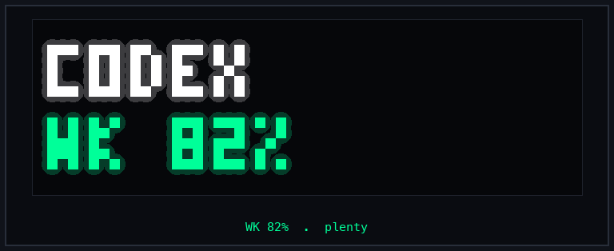
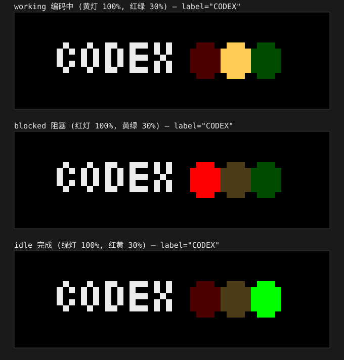
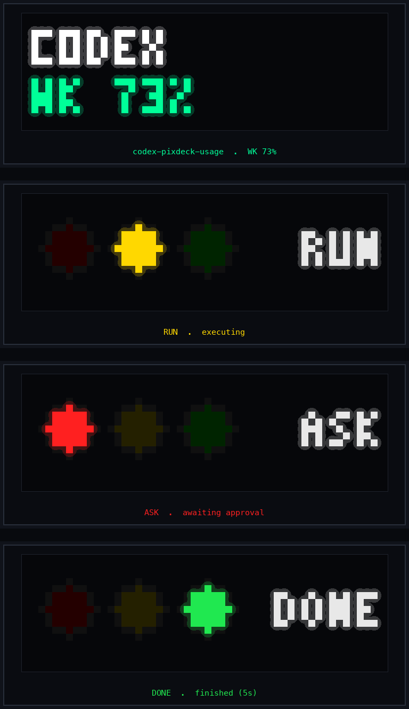

# Codex × TC002 状态投射 Skill 集

把 **OpenAI Codex** 的运行状态实时投射到 **Ulanzi TC002 / PixDeck 像素时钟（52×16）** 上：显示 Codex 周额度剩余，以及任务状态三色信号灯（RUN 黄 / ASK 红 / DONE 绿）。

纯 Python 标准库、HTTP 直连、零依赖、无 MQTT，Windows / macOS 通用。

## 项目来源

本项目是开源项目 [PixDeck](https://github.com/cailurus/PixDeck) 的**二次开发 / 衍生作品**（PixDeck 采用 GPL-3.0）。

**PixDeck 是什么**：一个本地网页应用，通过 Ulanzi 原厂固件的 *Custom App HTTP 协议* 控制 TC002 像素钟（无需刷机），并内置 `codex`、`codex-usage`、`claude` 等插件，用来把 AI 编程智能体的状态推到时钟上。

**本项目做了什么（因果链）**：

1. **沿用协议**：直接复用 PixDeck 所定义并验证过的 TC002 Custom App HTTP 控制协议与帧格式（`POST /api/custom`、`GET /getBase`、`GET /api/customList`，52×16 像素帧）。
2. **复刻能力**：移植 PixDeck 内置 `codex` / `codex-usage` 插件的两项核心功能——Codex 任务状态红绿灯、Codex 额度显示。
3. **重构形态**：将其改写为**可由 OpenAI Codex 自身调用的无头 Agent Skill**（纯 CLI、零依赖、去除 PixDeck 服务与 MQTT 依赖），让 Codex 自己监控自己、直接推屏。

> 说明：TC002 的 Custom App HTTP 协议由 Ulanzi 原厂固件定义，PixDeck 与本项目都只是它的使用者；本项目代码为独立重构（直接轮询 Codex 原始日志、无 PixDeck 源码依赖），但**功能设计与协议明确继承自 PixDeck**，因此属于其二次开发。

## 基础功能

本仓库包含两个可独立使用的基础功能：

**1. 额度显示（`codex-pixdeck-usage`）**
读取本地 Codex 会话的限流事件，把当前 **周额度剩余百分比** 显示在时钟上：
- 屏幕上方白字 `CODEX`，下方彩色 `WK XX%`；
- 颜色随剩余量变化：剩余 ≥ 50% 绿、≥ 20% 黄、< 20% 红；
- 支持 `--once` 单次推送与 `--watch` 变化推送两种模式。

**2. 状态红绿灯（`codex-pixdeck-traffic-light`）**
实时监控 Codex 的任务执行日志，用三色灯反映运行状态：
- **RUN（黄）**：有任务正在执行；
- **ASK（红）**：有待确认的权限请求（如审批弹窗）；
- **DONE（绿）**：任务完成，亮 5 秒后转暗灯待机；
- 多会话下严格按「红 > 黄 > 绿 > 待机」优先级聚合，避免一个任务掩盖另一个的待审批状态。

> 第三个目录 `codex-tc002-signal-light` 是上述红绿灯功能的**规范 / 蓝图版**：只给「如何构建」的文档与踩坑记录，不含可运行脚本，供自行重建或了解原理。

## 能呈现什么效果

### 额度显示（`codex-pixdeck-usage`）

白字 `CODEX` + 彩色 `WK XX%`，按剩余量变色（绿 ≥ 50% / 黄 ≥ 20% / 红 < 20%）



### 状态红绿灯（`codex-pixdeck-traffic-light`）

三盏灯反映运行状态：**RUN 黄**（执行中）/ **ASK 红**（待审批）/ **DONE 绿**（完成），空闲转暗灯待机；多会话严格按「红 > 黄 > 绿 > 待机」优先级聚合。

**UI 风格 A — 设备渲染版**（圆形灯 + 辉光 + `RUN`/`ASK`/`DONE` 文字标签）


**UI 风格 B — 像素矩阵版**（方形灯 + 左侧 `CODEX` 文字，暗灯保持 30% 亮度始终可见）



### 四状态总览



## 软硬件要求

**硬件**
- Ulanzi TC002（或兼容）像素时钟，支持 PixDeck / DIY Custom App，52×16 LED
- 与电脑同一局域网（TCP 80），USB 供电

**软件**
- 本地 OpenAI Codex（写入 `~/.codex/sessions` 日志）
- Python 3.9+（仅标准库，无需 pip 安装）
- macOS 12+ 或 Windows 10/11
- 防火墙 / 本地网络已放行设备访问

## 快速开始

```bash
# 额度显示
python codex-pixdeck-usage/scripts/codex_pixdeck_usage.py --device <IP> --watch

# 状态红绿灯（先测投递，再启监控）
python codex-pixdeck-traffic-light/scripts/codex_task_traffic_light.py --device <IP> --state running --once
python codex-pixdeck-traffic-light/scripts/codex_pixdeck_watcher.py --device <IP>
```

详细用法见各目录 `SKILL.md`；开机自启见对应 `references/`。

## 仓库结构

```
.
├── README.md
├── LICENSE                      # GPL-3.0（衍生自 PixDeck）
├── CONTRIBUTING.md              # 贡献指南
├── requirements.txt             # 零依赖说明
├── .github/workflows/           # CI（flake8 语法检查）
├── assets/                      # 预览图与 GIF
├── codex-pixdeck-usage/         # 额度显示 Skill
├── codex-pixdeck-traffic-light/ # 红绿灯 Skill（含可运行脚本）
└── codex-tc002-signal-light/    # 红绿灯规范版（构建指引，无脚本）
```

## 致谢

- [PixDeck](https://github.com/cailurus/PixDeck)（cailurus）—— 本项目的协议设计与功能灵感来源
- [Ulanzi](https://www.ulanzi.com/) —— TC002 像素时钟硬件

## 许可证

GPL-3.0。衍生自 [PixDeck](https://github.com/cailurus/PixDeck) (cailurus)。
